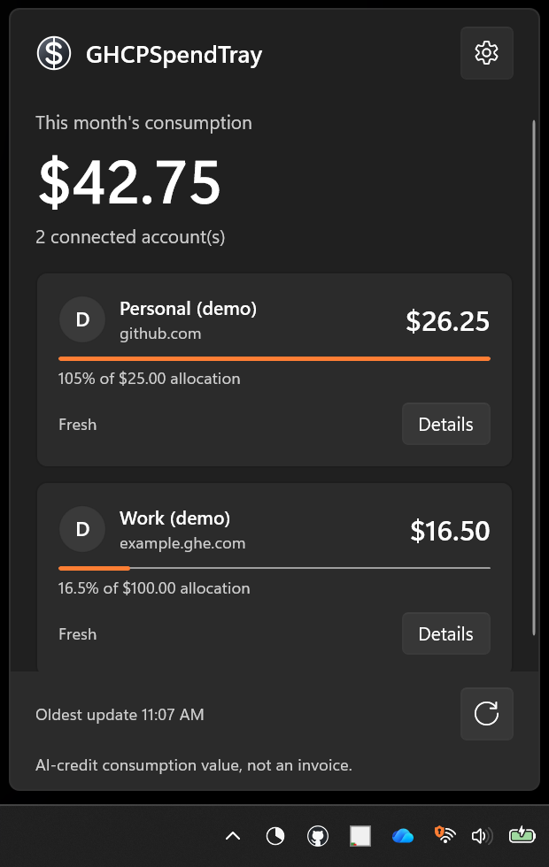
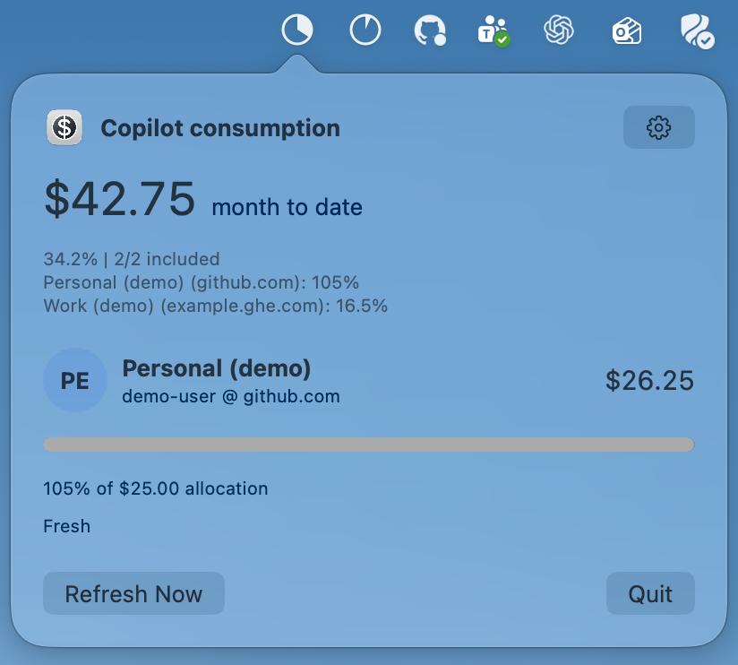

# GHCPSpendTray

[](https://www.microsoft.com/store/productId/9PMX96TSF295)
[](https://github.com/DamianEdwards/ghcp-spend-tray/releases?q=macos)

GHCPSpendTray is an independent Windows 11 tray and macOS menu-bar app for
keeping an eye on GitHub Copilot AI-credit consumption. It shows per-account
usage and allocation and offers optional spending alerts without a browser tab
or a hosted service.

[Install from the Microsoft Store](https://www.microsoft.com/store/productId/9PMX96TSF295)
&middot; [Download the latest macOS release](https://github.com/DamianEdwards/ghcp-spend-tray/releases?q=macos)
&middot; [All releases](https://github.com/DamianEdwards/ghcp-spend-tray/releases)
&middot; [Report an issue](https://github.com/DamianEdwards/ghcp-spend-tray/issues)

Both apps share their C# domain and application logic, compiled with .NET 10
Native AOT. Windows uses WinUI 3 and
[Microsoft UI Reactor](https://microsoft.github.io/microsoft-ui-reactor/main/);
macOS uses native SwiftUI and AppKit.
It does not require a separate .NET runtime, `gh`, WebView, or backend service.

<p>
  
  
</p>

## Features

- A tray flyout with per-account consumption and allocation meters.
- Configurable pie-chart or percentage tray icons: one weighted roll-up by
  default, or one icon per selected account.
- Multiple accounts, including different identities on the same GitHub host.
- Account avatars in the flyout and account settings when available, with
  initials when an image cannot be shown.
- Configurable refresh intervals and percentage or per-account USD-increment
  notifications.
- Local history and settings, with OAuth tokens in Windows Credential Manager
  or the macOS login Keychain.
- Opt-in launch at login on either platform.

## Install

### Windows

Requires Windows 11 22H2 (build 22621) or newer on x64 or ARM64.

Install [GHCPSpendTray from the Microsoft Store](https://www.microsoft.com/store/productId/9PMX96TSF295),
then start it from the Start menu. It stays in the notification area.

Alternatively, download `GHCPSpendTray-<version>.msixbundle` from
[GitHub Releases](https://github.com/DamianEdwards/ghcp-spend-tray/releases),
open the signed bundle in Windows App Installer, and select **Install**.
The bundle contains both architectures; the symbols archive is for debugging,
not installation. Do not bypass Windows trust or organization-policy warnings.

To update a GitHub-installed copy, exit the app from its tray menu and install a
newer signed bundle from Releases. GitHub-distributed builds do not check for
updates automatically. An update with the same package identity preserves
settings and history. The Microsoft Store package has a separate identity and
is **not** an in-place upgrade from the GitHub package.

### macOS

Supports **macOS 26 and macOS 15**, on their latest patch releases, with a
universal app for Apple silicon and Intel. We maintain a two-major-version
support window and advance it when adopting a new stable macOS major release.
macOS 14 Sonoma is no longer supported. Download
`GHCPSpendTray-macOS-<version>.dmg` from a **macOS** release on
[GitHub Releases](https://github.com/DamianEdwards/ghcp-spend-tray/releases?q=macos).
Open the disk image, drag **GHCPSpendTray** to **Applications**, then launch it.
The app lives in the menu bar, without a persistent Dock icon.
Public macOS releases must be Developer ID signed and Apple notarized; do not
bypass Gatekeeper or your organization's security policy. CI development
artifacts are not public releases.

Click the menu-bar icon to see consumption; secondary-click for **Open**,
**Refresh Now**, **Settings**, and **Quit**. Settings has the same **Usage**,
**Accounts**, **General**, **Notifications**, and **About** sections as Windows.
With no accounts connected, the popup shows an **Add Account** prompt instead
of unavailable totals, diagnostics, or refresh controls.
Use **General > Launch at login** to opt in; macOS may require approval in
**System Settings > General > Login Items**. Notifications also require macOS
permission and can be suppressed by Focus.

**Notifications > macOS Permission** shows whether notifications are allowed.
Use **Enable Notifications** to request access at a time you choose. If access
was previously denied, **Open Notification Settings** takes you to the macOS
controls; enable **Allow Notifications** there and return to the app. The status
refreshes automatically. Quiet delivery is identified separately from banners.
Background refreshes never open permission prompts or System Settings.

In **General > Menu Bar**, choose a pie or percentage, a single weighted roll-up
or one icon per selected account, and the accounts to include. The live preview
uses the shared allocation rules; only **Save** applies it to the menu bar.
The monochrome template graphics adapt to macOS light/dark menu-bar appearance.
Per-account icons open account settings. If macOS hides icons on a crowded
menu bar, reopening GHCPSpendTray brings its settings window forward.

Updates are manual: quit GHCPSpendTray, then replace the app in Applications
with a newer macOS release. Its stable bundle identifier preserves access to
local settings, history, and Keychain credentials. Windows (`v*`) and macOS
(`macos-v*`) releases have independent versions; neither platform upgrades or
migrates the other's local data. The Mac app does not use the App Store.

Maintainers publish either or both platforms through **Actions > Release**.
Each platform has `no release`, `Major`, `Minor`, or `Patch` choices (default
`Minor`), calculated from its latest stable release. With none, the baseline
is `0.0.0`, making the default first release `0.1.0`.
See [release setup and retry rules](docs/RELEASING.md).

## Connect an account

1. Open the tray flyout and choose the connect button, or open
   **Settings > Accounts > Add account**.
2. A github.com sign-in code is generated immediately and copied to the clipboard.
   Select **Open browser** (**Open Authorization Page** on Mac), paste the code
   on GitHub, and authorize GHCPSpendTray.
   Check the account and OAuth app shown on GitHub before approving. If copying
   failed, use **Copy code** to retry or select and copy the displayed code yourself.
3. Return to GHCPSpendTray. The account is verified and saved automatically after
   browser authorization; a success message appears when setup finishes. There is no
   additional in-app confirmation.

The code panel identifies the active host above the code instructions, with
**Change host** beside it. For an enterprise account, select it to cancel the github.com attempt,
choose the host and its OAuth Client ID, check the displayed destinations, then
select **Start sign-in**. New Add account actions always start with github.com.
**Reconnect** starts immediately using the account's original host and registration;
a different browser identity is rejected rather than overwriting that account.
**Cancel sign-in** stops the current attempt, and **Try again** generates a new code.
Sign-in failures are reported in the UI and diagnostic logs without logging
device codes, tokens, or server response bodies. Clipboard failures are visible
and can be retried without restarting sign-in.

The app has built-in public OAuth registrations for `github.com` and
`msft.ghe.com`; it does not use `gh` credentials or ask for a client secret.
For another enterprise host, create an approved host-specific OAuth app with
Device Flow enabled and enter its Client ID during onboarding. The ID is
stored with that account and used for reconnect and token refresh; existing
accounts on built-in hosts retain their registrations. Enterprise SSO,
managed-user, IP, and application policies may require administrator approval. Successfully
signing in to a host does not establish that its Copilot consumption API
is available.

The app downloads and caches avatars in its local data directory at sign-in,
so signed image links can expire without making the picture disappear. The
**Refresh** button on an account's management page fetches a new avatar as
well as consumption. Existing accounts without a cached image can use that
button to populate it; initials appear when no image is available.
Removing an account also removes its cached image.

GHCPSpendTray currently requests `read:user` for identity and optionally
`offline_access` for refresh tokens where supported. Consumption comes from
an **undocumented GitHub endpoint** that may change or be unavailable on some
hosts; the minimum OAuth scope for it has not been established. The app reports
unavailable data rather than treating it as zero. See
[validation and known limitations](docs/VALIDATION.md).

## Use and notifications

On Windows, left-click the tray icon to toggle the flyout or double-click it to open
**Settings > Usage**; right-click it for **Open**,
**Refresh now**, **Settings**, and **Exit**. Settings opens on **Usage**, with the
current total, per-account consumption and diagnostics, availability status,
and a manual refresh action. With no accounts connected, Usage instead shows a
simple **Add account** prompt without empty totals, diagnostics, or refresh controls.
**Accounts** manages connections and
per-account preferences; **General** and **Notifications** configure refresh
and alerts. **About** shows the running app's version, including preview labels.
The default refresh interval
is 60 minutes (configurable from 5 to 1440), and the default allocation alerts
are 50%, 80%, and 100%.

In Windows **Settings > General > System tray** (Mac: **General > Menu Bar**), choose **Pie chart** or **Percentage
number**, one roll-up or per-account icons, and the connected accounts to include.
Choose **Save changes** to apply and persist the preferences. By default all
accounts, including newly connected accounts, contribute to a single pie.
The **Live preview** updates immediately as you change the draft style, icon mode,
or included accounts. It uses current usage and the same native-size pixels as
the real icons, with labels identifying each account. Previewing does not change
the notification area or save anything; a failed save leaves the existing tray
configuration unchanged. Freshness and availability updates also reach the preview.
Per-account icons open their account details on click; **Open GHCPSpendTray**
in any icon's context menu still opens the flyout. Double-click, keyboard access,
refresh, Settings, notifications and Exit remain available. If no accounts are
selected or connected, a neutral access icon remains.

The roll-up percentage is **eligible consumption divided by the same accounts'
eligible allocation**, not an average of account percentages. Only valid, fresh,
current-period observations with known, finite positive allocation qualify.
Stale, failed, unsupported, unknown/zero-allocation and unlimited accounts are
excluded from both sides. `!` marks a partial roll-up; `?` means no percentage is
available, not zero. On macOS, an unavailable pie stays an empty outline with
an `!` badge; percentage mode still shows `?`. The badged empty pie does not
mean 0% usage. Hover for the percentage and included/selected counts;
**Settings > Usage** lists every selected account and its inclusion or exclusion
reason. These preferences do not filter or change the existing dollar totals.

Numbers are rounded to whole percentages, with `<1` below 1% and `999+` above
999%. Numbers use native font glyphs rather than a pixel font; the percentage
unit is shown in the tooltip and preview label instead of a tiny extra glyph.
Both styles are antialiased at the taskbar's pixel size on a transparent canvas.
The settings preview places them on a taskbar-colored swatch so they remain
readable when the app and taskbar themes differ.
Pies fill to 100%; a `+` on either style marks over-allocation. Tooltips retain the
unsaturated percentage (up to two decimals, with `<0.01%` for smaller nonzero
values) and label over-allocation. Eligibility is reevaluated at least every
minute and on refresh/resume, including billing rollover. Windows controls
notification-area overflow and icon visibility; the app cannot force icons to
remain unhidden.

In **Settings > Notifications**, you can also set a USD increment (for example,
`50` for alerts at $50, $100, and so on). An account can inherit that value,
override it, or disable it. Unknown or unlimited allocations can still use
dollar alerts, but not percentage alerts. Windows may suppress a notification
even when the app submits it.

Displayed USD consumption is `credits_used / 100` from GitHub's token-billing
quota data. It is **not** an invoice, a finance budget, or total spend across all
GitHub products. Stale or partial observations are identified; previous billing
periods are not counted as current spend. GitHub's quota snapshot does not
provide a verified per-day consumption breakdown, so the app does not chart
daily usage from its locally sampled refreshes.

On macOS, **Settings > Accounts > select an account > Show estimated period
consumption** enables an optional **Estimated at reset** row in that account's
popup, Usage summary, and details. It is off by default; choose **Save** to
apply it. There is no combined forecast, forecast-based alert, or change to
the observed allocation meter or menu-bar icons.

The estimate extrapolates the account's average consumption so far across a
UTC calendar month, not its recent usage trend. It assumes the same pace
continues and is not an invoice. A supplied reset must match the next first
of the month at midnight UTC; a missing reset uses the calendar-month
fallback. Estimates remain unavailable for the first 24 hours, are labeled
early before 72 hours, and show a reason when data is stale, failed, expired,
or inconsistent with that period. Estimates are rounded to whole USD
(`<$1` for small nonzero values); actual consumption retains cents.
Unknown or unlimited allocation still allows a dollar forecast without an
over-allocation comparison. Advanced Details explains the method and shows
the average per day, period boundaries, and observation time.

## Privacy and removal

GHCPSpendTray talks directly to your GitHub host over HTTPS. It does not send
account data or diagnostic logs to a developer-operated backend. Settings and
history are stored locally; access and refresh tokens are held in Windows
Credential Manager or the macOS Keychain. Use **Settings > General > Open data folder** to find your
local files. See the [privacy policy](PRIVACY.md) for retention and data handling.

Before uninstalling, remove accounts in the app to delete their locally stored
credentials. To revoke an OAuth grant, use **Manage OAuth grants** in account
details or the host's application settings; removing an account or uninstalling
does not necessarily revoke it. Then exit the app and uninstall through
**Windows Settings > Apps > Installed apps**. Windows normally removes
package-local data, but generic Credential Manager entries may remain.

On macOS, disable **Launch at login**, remove accounts, quit the app, and move
it from Applications to the Trash. Deleting the app does not delete
`~/Library/Application Support/GHCPSpendTray` or its Keychain items. Remove
that data directory separately if desired. If credentials remain, remove only
the app's `com.damianedwards.GHCPSpendTray` service items in Keychain Access.

If sign-in or consumption fails, check the displayed host destinations and
error, your organization's policy, and the app's bounded `logs` directory in
the data folder. Do not post tokens, device codes, unredacted configuration or
history, or private consumption details in public issues.

## Build and contribute

### Windows development

Install the .NET SDK pinned in [`global.json`](global.json), Visual Studio
C++ build tools, the Windows SDK, and ARM64 native tools. From PowerShell:

```powershell
git clone https://github.com/DamianEdwards/ghcp-spend-tray.git
Set-Location ghcp-spend-tray
.\tools\verify.ps1
.\tools\package.ps1
```

`verify.ps1 -NativeTests` also runs the test suites under executed x64 Native
AOT. Run build and publish commands sequentially because they share
intermediates. Local `package.ps1` output is an **unsigned development bundle**,
not the signed public release. For isolated synthetic UI checks, see
[`VALIDATION.md`](docs/VALIDATION.md); for release and signing details, see
[`RELEASING.md`](docs/RELEASING.md).

### macOS development

Install the SDK pinned in `global.json` and stable Xcode Command Line Tools
with Swift 6 (`xcode-select --install` if missing). A separate .NET macOS
workload, MAUI, or Xcode project is not required. Python 3 is used by build and
release checks. From the repository root:

```bash
bash tools/macos/verify.sh
open artifacts/macos/GHCPSpendTray.app
```

Verification runs managed and native shared tests, builds a universal
arm64/x86_64 app, exercises synthetic Keychain items, and launches populated
and empty SwiftUI smoke scenarios. The Keychain test deletes its own uniquely
named synthetic item; it never reads account credentials or enables login
startup. The resulting app is ad-hoc signed for local development only.
`bash tools/macos/build.sh` builds without running tests. If using a preview
toolchain, select a stable SDK with `SDKROOT`; see [release documentation](docs/RELEASING.md).

To run an empty, isolated preview alongside an installed release:

```bash
preview_dir="$(mktemp -d -t ghcp-preview)"
open -n artifacts/macos/GHCPSpendTray.app --args --demo-empty --data-dir "$preview_dir"
```

**Add Example Account** adds synthetic usage to the open popup so you can
check its live resizing and position without signing in. The button appears
only in sample mode, both before and after adding examples. Each click adds
one account; examples last only for that process and are not saved. Use
`--demo` instead of `--demo-empty` to start with the existing sample accounts.
Both modes require a separate data directory and disable authentication,
notifications, and launch-at-login changes; they do not access saved accounts
or credentials.

The Windows solution is [`GHCPSpendTray.slnx`](GHCPSpendTray.slnx).
`Core` contains domain, HTTP, and storage code; `Application` contains the
shared controller and view models; `App` contains Windows UI/platform
integration; `MacBridge` exports the Native AOT C ABI, and `Mac` contains
SwiftUI/AppKit UI and native services. Build platforms sequentially when using
the same checkout. Use synthetic data in tests and issue reports.

## License

[MIT](LICENSE). Copyright (c) 2026 Damian Edwards.

GHCPSpendTray is not affiliated with or endorsed by GitHub. Included .NET,
Windows App SDK, and Reactor components retain their own applicable licenses.
